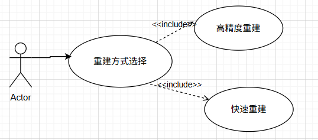
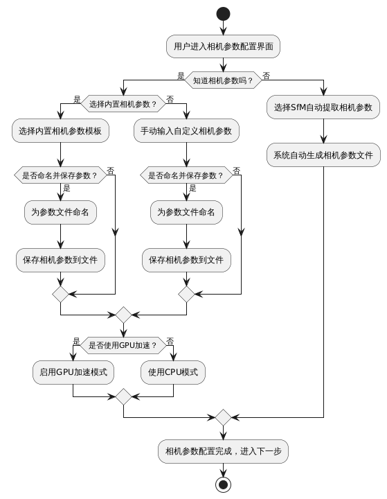
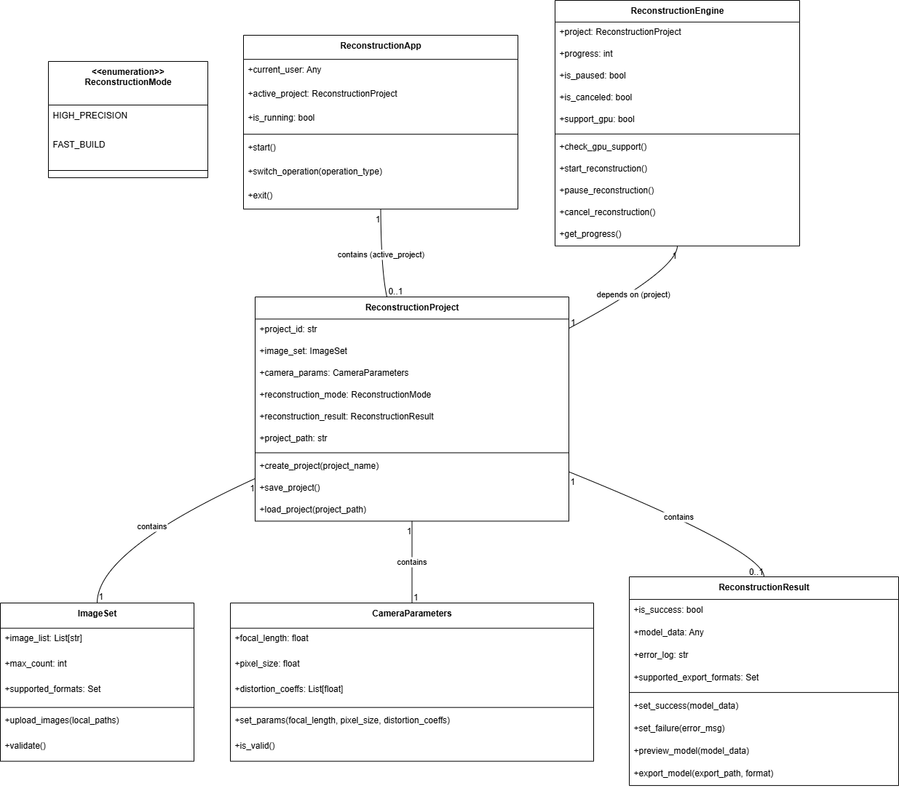
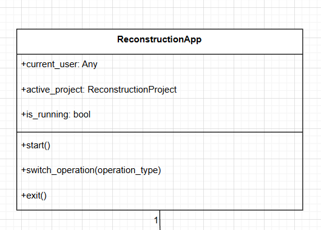
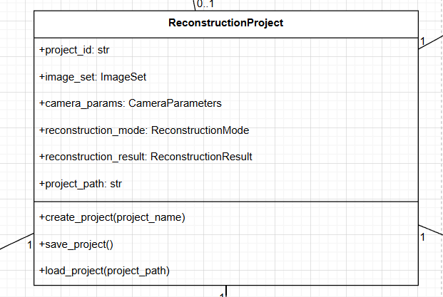

# 流程图

# 需求用例图
## 功能需求  
系统功能需求概述，系统总体包括几个模块。  
#### （1）上传本地图片册
可以选择上传PNG,JPG格式的图片，上限100张

#### （2）用户选择重建方式
高精度重建   快速重建

#### （3）输入相机参数
1. 知道相机参数时
用户自动导入相机的内参和外参  --同时可以选择对参数文件命名，保存该参数
用户通过内置的参数模版选择对应的相机参数（包含主流的几个相机的参数）
用户可选择是否使用GPU
2. 不知道相机参数时
选择自动提取相机参数，自动生成相机参数文件

使用活动图画：

#### （4）三维重建
用户点击三维重建，选择特定算法后即开始三维重建过程
可以选择开始，暂停，取消（删除重建过程中所有文件）

使用状态图画：

#### （5）点击模型预览 
可以依次查看点云重建，稠密重建，纹理贴图等步骤完成后的图片，支持缩放，旋转等

#### （6）点击导出
最终三维重建后的最终三维图像会导出为.ply 或 .ojb 等文件，支持使用 Meshlab 或者其他建模软件打开。

(低优先度需求)
#### (7) 实时重建扩展模块​（饼）
在上传图片的时候，点击在线上传，打开云空间同步文件夹，选择云空间的同步文件夹中的图片。

#### (8) 统计与归档模块​ (饼)
用户点击查看，选择.ply 或 .ojb 的三维重建文件，即可在程序中打开该三维重建文件，会内置比例尺便于用户估算物件大小。

- **项目管理与归档**：支持创建 “项目文件夹”（比如 “2024 年 3 月文物重建项目”），把该项目的图片、参数、模型、日志统一存放在一起，方便后续查找、复用（比如下次重建同类文物，直接复制项目参数）。

主要类的类图：

#### 1. 应用入口类（`ReconstructionApp`）

- **核心职责**：控制软件启动、初始化模块、管理主流程跳转
- **属性**：
    - `current_user`：当前登录用户（当前我们这个 `current_user` 的变量只是为了引导后面的操作，后面也许可以扩展用户权限管理）。
    - `active_project`：当前激活的重建项目（`ReconstructionProject` 类型）。
    - `is_running`：软件运行状态（布尔值）。
- **方法**：
    - `start()`：启动软件，加载主界面并进入操作类型选择。
    - `switch_operation(operation_type)`：根据用户选择切换操作（新建任务 / 打开已有项目）。
    - `exit()`：关闭软件，释放资源。

#### 2. 重建项目类（`ReconstructionProject`）

- **核心职责**：封装单个重建任务的全量数据
- **属性**：
    - `project_id`：项目唯一标识
    - `image_set`：项目关联的图片集合（`ImageSet` 类型）。
    - `camera_params`：相机参数（`CameraParameters` 类型）。
    - `reconstruction_mode`：重建模式（enum：`HIGH_PRECISION`/`FAST_BUILD`）。（现阶段先实现`FAST_BUILD `)
    - `reconstruction_result`：重建结果（`ReconstructionResult` 类型，初始为`None`）。
    - `project_path`：项目存储路径（本地文件夹路径）。
- **方法**：
    - `create_project(project_name)`：创建新项目，生成默认存储路径(现阶段项目先统一存储在图片集的目录下，后续再进行管理)。
    - `save_project()`：保存项目，将图片、参数、结果写入`project_path`。
    - `load_project(project_path)`：加载已有项目。

#### 3. 图片管理类（`ImageSet`）

- **核心职责**：处理图片上传、格式 / 数量校验。
- **属性**：
    - `image_list`：图片文件列表（存储图片路径）。
    - `max_count`：最大只能上传 100 张图片。
    - `supported_formats`：支持的图片格式（集合：`{"png", "jpg"}`）(后续再考虑如jpeg等格式的图片识别）。
- **方法**：
    - `upload_images(local_paths)`：上传本地图片，将路径加入`image_list`，并自动读取 `image_list`中的所有图片（后续可扩展至给用户选择权用户可自主选择哪些图片）。
    - `validate()`：校验图片格式（是否在`supported_formats`集合里）和数量（是否≤`max_count`），返回校验结果和错误信息。

#### 4. 相机参数类（`CameraParameters`）

- **核心职责**：封装和校验重建所需的相机参数。
- **属性**：
    - `focal_length`：焦距（毫米单位，> 0）。
    - `pixel_size`：像素尺寸（微米单位， > 0）。
    - `distortion_coeffs`：畸变系数（列表，如 [k1, k2, p1, p2, k3]，默认全为 0）。
    - （事实上考虑到这些参数用户往往自己也看不出哪些部分是焦距那些部分是畸变系数，最后的实现方式大概是直接读取全部相机参数，用户只需要粘贴参数即可，不会分开一条一条写。）
- **方法**：
    - `set_params(focal_length, pixel_size, distortion_coeffs)`：设置相机参数。
    - `is_valid()`：校验参数有效性（焦距 / 像素尺寸为正数），返回布尔值和错误信息（哪一步参数有错）。

#### 5. 重建引擎类（`ReconstructionEngine`）

- **核心职责**：执行三维重建算法，处理 GPU/CPU 切换、进度反馈（目前仅实现全部基于 CPU 上的重建，获取实现重建的进度，后续再提供控制暂停、取消和 GPU 加速的模块）。
- **属性**：
    - `project`：待重建的项目（`ReconstructionProject` 类型）。
    - `progress`：重建进度（百分比，0-100）。
    - `is_paused`：是否暂停（布尔值）。
    - `is_canceled`：是否取消（布尔值）。
    - `support_gpu`：是否支持 GPU 加速（布尔值，第三阶段启用）。
- **方法**：
    - `check_gpu_support()`：检测系统是否支持 CUDA，更新`support_gpu`属性。
    - `start_reconstruction()`：启动重建，根据`support_gpu`选择 CPU/GPU 模式
    - `pause_reconstruction()`：暂停重建
    - `cancel_reconstruction()`：取消重建，释放中间资源
    - `get_progress()`：获取实时重建进度，用于界面显示

#### 6. 重建结果类（`ReconstructionResult`）

- **核心职责**：管理重建结果（成功 / 失败）、模型预览和导出。
- **属性**：
    - `is_success`：重建是否成功
    - `model_data`：重建后的模型数据（内存中模型结构，如点云模型、网格模型，还是其他的）。
    - `error_log`：错误日志（重建失败时存储原因，失败原因暂时用 openMVS 自己的日志）。
    - `supported_export_formats`：支持的导出格式（集合：`{"obj", "ply"}`）。
- **方法**：
    - `set_success(model_data)`：设置重建成功，存储`model_data`。
    - `set_failure(error_msg)`：设置重建失败，记录`error_log`。
    - `preview_model(model_data)`：处理模型预览操作（用 Meshlab 打开模型即可）。
    - `export_model(export_path, format)`：导出模型到指定路径，格式需在`supported_export_formats`内( 暂时先统一存储在图片集的目录下）。

对项目管理方面的扩展：
数据库方面
事实上，如果我们的平台永远是 单人使用且项目数量不多 ，只用文件系统也够用了。但是为了适应多项目管理需求和快速查询，使用数据库还是会快不少。因为考虑是单人本机使用，所以使用 SQLite 数据库，因为它比较轻量且不需要部署。

实现思路：用 SQLite 存储项目的核心数据（如 project_ID、路径、参数），文件（图片、如果重建好了包括重建好的模型）仍存在本地文件夹，通过 “数据库表 - 类属性” 映射建立关联，这样类中属性修改后就直接保存到数据库里了。

时序图

由于是很大一张，仅展示部分

